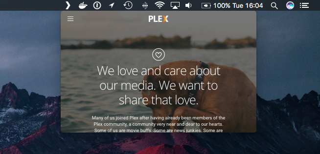

# Menubar Player for Plex



An embeddable webview pointing directly at `https://app.plex.tv/web`.

This exists literally so I could learn how to
[begin](https://github.com/electron/electron/blob/master/docs/tutorial/quick-start.md) &
[deploy](https://npm.im/electron-packager)
[Electron](https://electron.atom.io/) [menubar](https://github.com/maxogden/menubar) apps.

## Use

Download [the latest release](https://github.com/jdrydn/electron-plex-menubar/releases), unzip & drag into
*/Applications*. You can also optionally add the application to your list of **Login Items** to auto-start at boot.

## Development

```sh
$ git clone https://github.com/jdrydn/electron-plex-menubar
$ npm install
$ npm run dev # To execute
$ npm run build # To build a production copy
```

## Notes

All [three Plex icons](http://brand.plex.tv/) are Copyright &copy; 2017 Plex.
